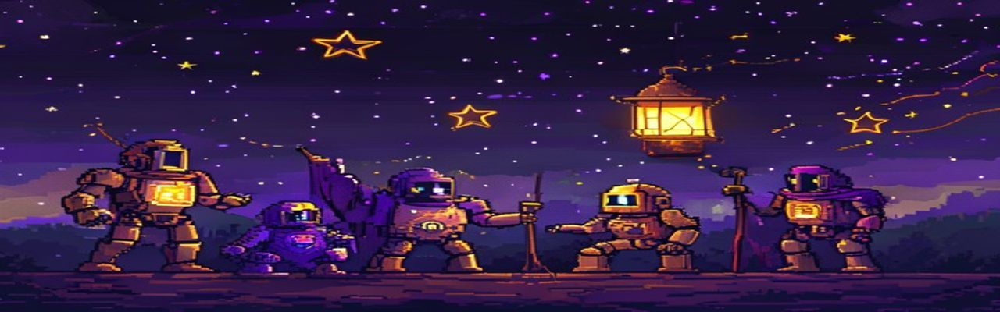

# thebardchat on Twitch — Love & Light Broadcasting



> **Try Claude free for 2 weeks** — the AI powering this entire ecosystem. [Start your free trial →](https://claude.ai/referral/4fAMYN9Ing)

---

**twitch.tv/thebardchat** — A family streaming channel built on faith, sobriety, and love. Where the Brazelton crew games, creates, and connects. No toxicity. No dark corners. Just real people, real AI, and real community.

[](https://twitch.tv/thebardchat)
[](https://thebardchat.github.io/twitch/)
[](CONSTITUTION.md)
[](https://discord.gg/thebardchat)
[](https://claude.ai/referral/4fAMYN9Ing)

---

## The Mission

The internet has enough darkness. Enough rage-bait, negativity, and performative chaos. This channel exists to be the opposite — a place where a dad and his boys show up authentically, where AI is demystified and made human, and where the community feels genuinely welcomed.

Shane Brazelton (thebardchat) built a full local AI infrastructure on a Raspberry Pi 5 to serve the people Big Tech is leaving behind. This channel is where that mission goes live.

---

## Who Streams Here

| Streamer | What They Do |
|----------|-------------|
| **Shane (thebardchat)** | AI demos, dispatch life, creative sessions, family stories |
| **Gavin** | Gaming, positive vibes |
| **The Crew** | When the boys show up, anything can happen |

---

## What to Expect

- **AI Live Demos** — Watching ShaneBrain, the MEGA Crew bots, and Claude work in real time
- **Family Gaming Nights** — Brothers vs. brothers, Dad loses gracefully
- **Creative Sessions** — Book readings from *You Probably Think This Book Is About You*
- **Honest Conversations** — Sobriety, faith, parenting, the real stuff
- **!shanebrain Command** — Ask the AI anything live in chat, answered by local Ollama
- **Community Events** — Viewers vote on outcomes, shape the stream

---

## Repo Structure

```
twitch/
├── index.html              # GitHub Pages — stream schedule + social hub
├── CONSTITUTION.md         # Channel values and community rules
├── CLAUDE.md               # Claude Code session instructions
├── bot/
│   ├── bot.py              # Twitch chat bot (twitchio Python)
│   └── commands.py         # !shanebrain, !sobriety, !love, !crew, !book
├── discord/
│   └── README.md           # Discord server guide — channels, roles, bot commands, go-live alerts
├── alerts/
│   ├── go-live.html        # Go-live Discord + social notification trigger
│   └── overlay.html        # OBS browser source overlay (1920x1080)
├── n8n/
│   ├── twitch-go-live.json # Webhook → Discord embed + Weaviate log
│   └── clip-highlight.json # Auto-clip → Facebook/Discord posting
└── docs/
    ├── PLAN.md             # Full autonomous Twitch build plan (5 phases)
    ├── setup.md            # Twitch Developer App + OAuth guide
    └── commands.md         # All chat commands and responses
```

---

## Bot Commands

| Command | What It Does |
|---------|-------------|
| `!shanebrain <question>` | Live AI answer from local Ollama cluster |
| `!sobriety` | Days Shane has been sober (since 11/27/2023) |
| `!love` | Random love-and-light quote from Weaviate |
| `!crew` | Meet the MEGA Crew AI bots powering the stream |
| `!book` | Info on Shane's noir vignette book |
| `!discord` | Discord server invite |
| `!clip` | Clip the last 60 seconds |

---

## Tech Stack

| Layer | Tool |
|-------|------|
| Bot | twitchio (Python 3.13) |
| AI commands | ShaneBrain MCP → local Ollama cluster (Pi 5) |
| Stream alerts | N8N webhooks → Discord |
| Clip pipeline | Twitch API → N8N → Facebook/Discord |
| Overlays | OBS Browser Source (HTML/CSS/JS) |
| Schedule page | GitHub Pages (this repo) |
| Logging | Weaviate ExternalPerspectives collection |

---

## Setup

See [`docs/setup.md`](docs/setup.md) for Twitch Developer App setup, OAuth token generation, and bot deployment on the Pi 5.

**Required environment variables** (stored in Weaviate vault):
```bash
TWITCH_CLIENT_ID=your_client_id
TWITCH_CLIENT_SECRET=your_client_secret
TWITCH_OAUTH_TOKEN=oauth:your_token
TWITCH_CHANNEL=thebardchat
SHANEBRAIN_MCP_URL=http://localhost:8100/mcp
DISCORD_WEBHOOK_URL=your_webhook
```

---

## Community Rules

This channel runs on love and light — and that's non-negotiable. The short version:

1. **No hate, no toxicity, no exceptions** — slurs, harassment, and dark energy get you removed
2. **Family-friendly first** — kids watch this channel
3. **Sobriety-safe space** — no glorifying alcohol or drug use
4. **AI disclosure** — AI tools are welcome here, just say so
5. **Respect the crew** — mods have final say, always
6. **No unsolicited promos** — ask first

**Read the full [CONSTITUTION.md](CONSTITUTION.md)** — Nine Pillars, moderation philosophy, AI disclosure policy, and amendment process. It's short and worth the read.

The Discord lives here too: [`discord/README.md`](discord/README.md) — channels, roles, bot commands, and go-live alerts.

---

## The Full Plan

See [`docs/PLAN.md`](docs/PLAN.md) — 5 phases from bare channel to autonomous, AI-curated family streaming platform.

---

## Built By

**Shane Brazelton + Claude (Anthropic)**

> Never "one guy built this" — Shane is the vision, Claude is the velocity. Together.

Faith. Family. Sobriety. Local AI. The left-behind user.

---

*Built with [Claude](https://claude.ai/referral/4fAMYN9Ing) — try it free for 2 weeks.*
